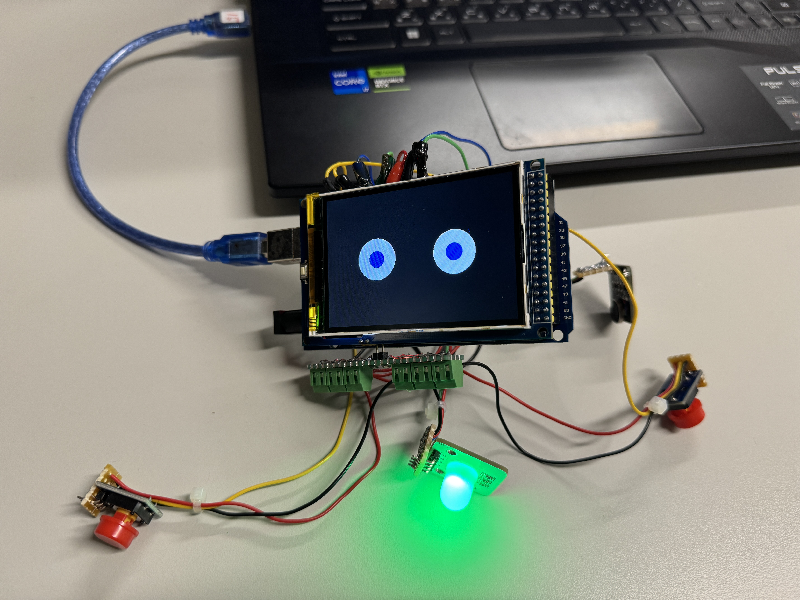
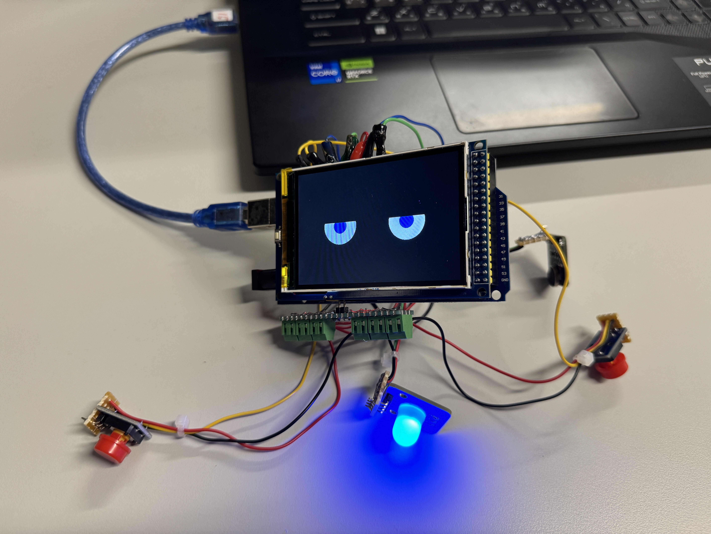
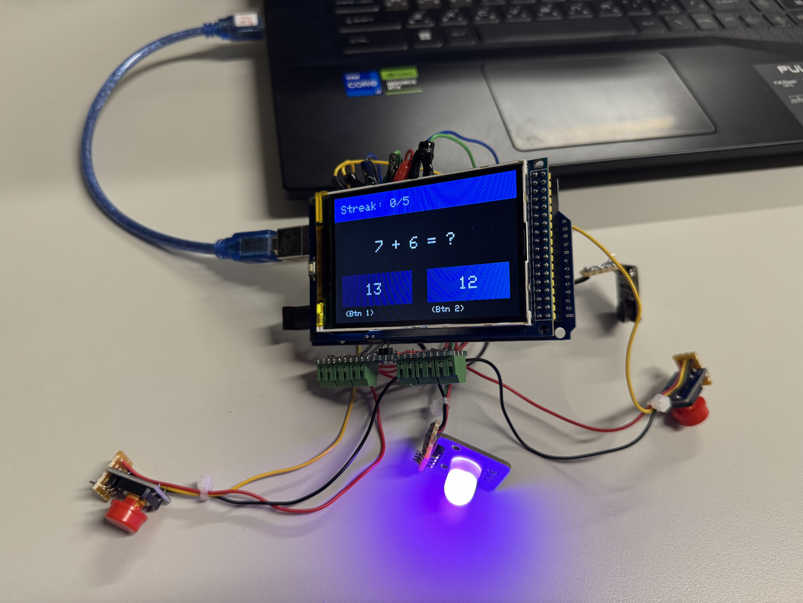
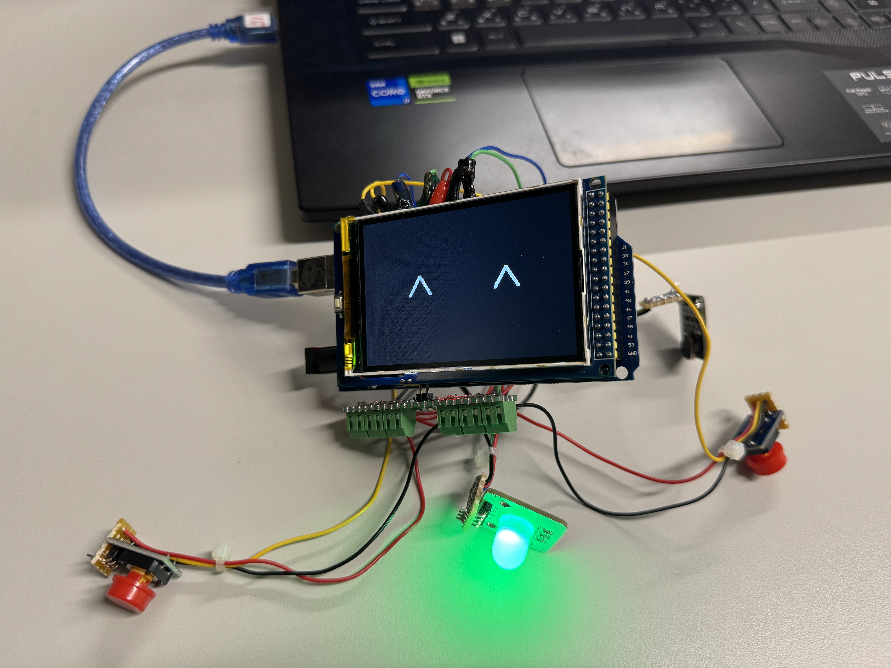
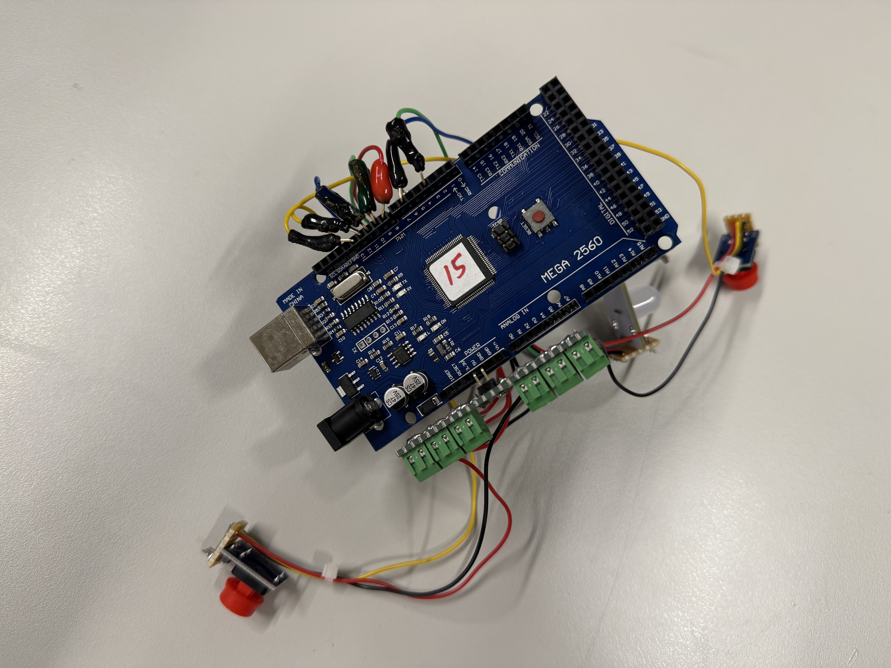
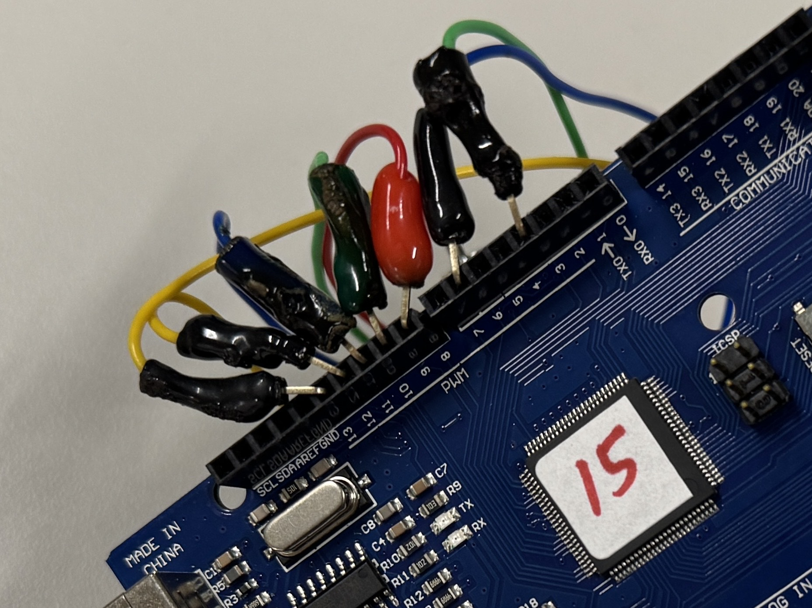

# Flexi Robot

Arduino-based companion robot

## Features
- **asdf -** asdf

## Hardware
|Component | Description |
| :--- | :--- |
| **Arduino Mega 2560** | System microcontroller |
| **3.5" TFT Display Shield** | asdff |
| **Push Buttons** | Buttons for controlling mood & answering math questions |
| **Multi-color LED** | LED light for showing mood state |
| **Buzzer** | Makes noise during answer errror or win state |
| **Vibrator** | Vibrates during answer correct |

